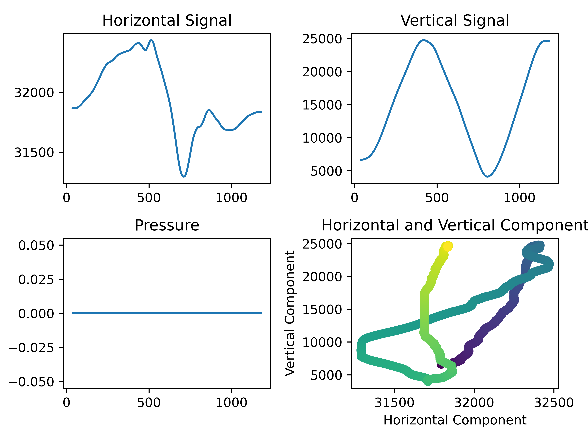
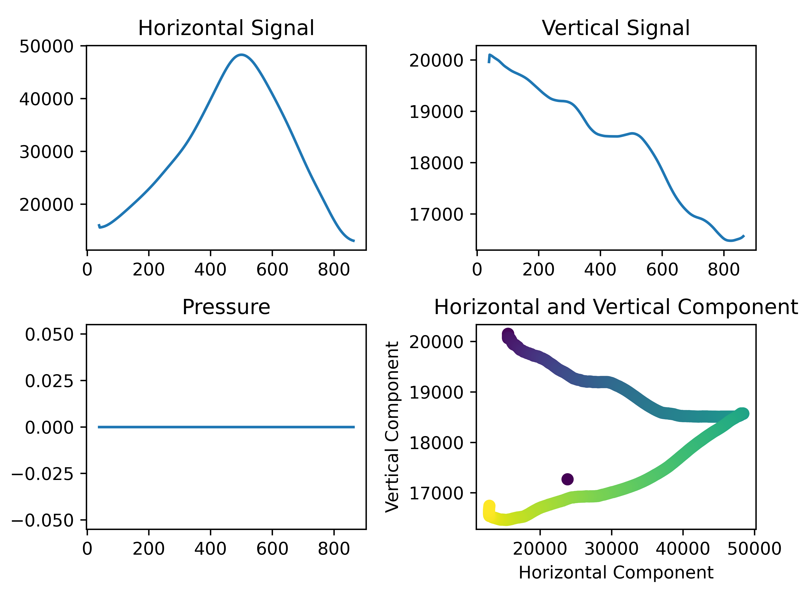
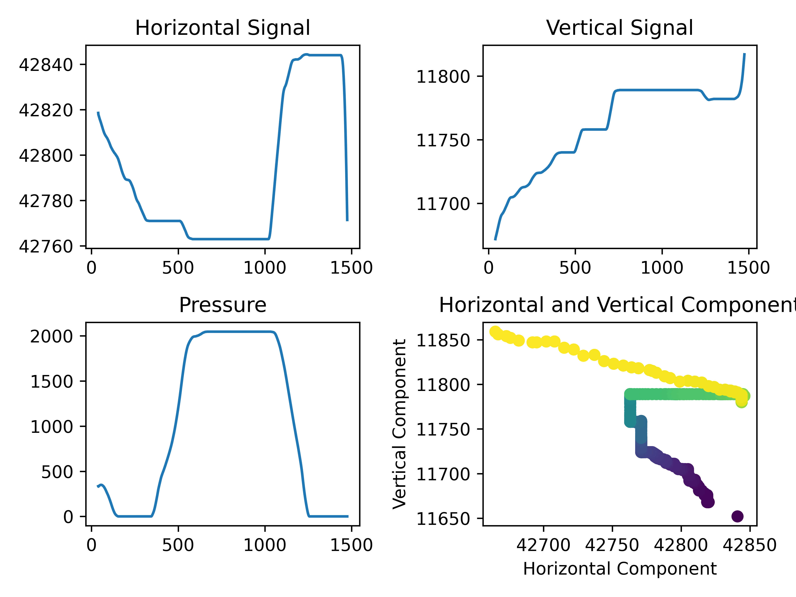

# Driver for Huion WH1409

My plan for this is to write a driver for the Huion WH1409 graphic tablet in rust by
understanding the usb signal sent by the device and mapping that to controls.
This is largely an exercise for fun and might not produce usable driver.

THIS IS A WORK IN PROGRESS AND BY NO MEANS DONE.
CURRENT STAGE IS FIGURING OUT HOW THE SIGNAL WORKS.


# Plan of Action
1. [x] Acquire sample data using usbhid-dump (This is a script now.)
    1. Find device adress using `lsusb`
    2. Use `usbhid-dump -es -t 1000 -a <address>` to generate 1s of Signal data
2. [x] Create function in Rust for reading and parsing that data
3. [x] Switch to C
4. [ ] Figure out how to write a kernel module usb driver
5. [ ] Find out how to directly read from usb
6. [ ] Find out how to set mouse position etc.
7. [ ] Find out how interaction of drivers with drawing programs like GIMP works

## TODOs
- [x] What is going wrong with signal processing? Should be 0x07FF = 2048 at
max pressure signal but is ~14500. WTF? -> I fucked up the signal parsing from text
- [x] Figure out endianness of signal and processing -> Little Endian!
- [x] Figure out signed-ness of signal (current assumption = unsigned maybe wrong) -> Unsigned
- [ ] Better plotting for signal analysis
- [ ] Figure out if sent signal is an offset of some sort

# Dependencies
mostly for debugging / signal generation purposes

| Program       | Use                     |
|---------------|-------------------------|
| lsusb         | find device name        |
| usbhid-dump   | generate sample signal  |
| grep, tr, awk | filtering sample signal |
| cmake         | compilation             |
| ninja         | optional, compilation   |

# How-To
## Generating Sample Data (./scripts/generate\_sample\_data.sh)
`generate_sample_data.sh` is a small script to generate a stream of bytes (as hex
string) mostly for debugging purposes (e.g. to have sample data to use repeatedly).
Intended use is like this:
```bash
generate_sample_data.sh > sample_signal.txt
```
Intention is to then be able to decode that using a decoding function

## Ploting processed Outputs (./scripts/plot\_output.py)
`plot_output.py` can be used to plot the processed signals. Expects values to be
in format: (status, vertical, horizontal, pressure), one datapoint per line, separated by a
single space.

## Processing multiple signal files
After generating sample signals, you might want to process all of them as a batch.
Place them in `./data/in/` and run `./scripts/process_all_in_signals.sh`. This will
process all of them and place output files in `./data/out/`.

## Compilation
The `makefile` is there for convenience. If ninja is installed, compilation will use ninja.
If not, standard unix makefiles will be used.

| Target      | Description                          |
|-------------|--------------------------------------|
| clean       | Remove build output                  |
| run\_cmake  | Run cmake (duh)                      |
| parse\_text | Text signal parsing utility          |
| usbmon      | USB monitoring utility (coming soon) |


## Better Development with ccls
After generating cmake files, use
```bash
ninja -C build -t compdb > compile_commands.json
```
in the root directory. `ccls` can then use the generated compilation commands.

# Signal Structure
Each Stream Signal is Composed of 8 Bytes:
1. Two Bytes for the Status:
    1. `07 80` if Pen is lifted and in range of tablet (-> move mouse)
    2. `07 81` if Pen is touching the tablet (-> click / draw)
2. 4 Bytes (little endian) encoding Position (Horizontal, Vertical)
3. 2 Bytes encoding Pressure (little endian)

## Position Encoding
Figured out Position encoding:



## Pressure Encoding
Limited at high end to 0x07FF (2047), probably due to sensor resolution. Low threshold might
be limited through calibration in device firmware. Although plot shows no jumping in the
signal. This indicates that no thresholding is taking place.

